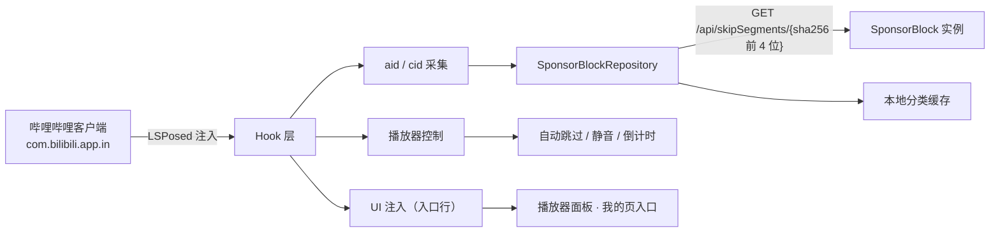

# Bili2233 · B站 SponsorBlock 跳过模块

[](https://github.com/ch6vip/lsposed-bili-sponsorblock/actions/workflows/android.yml)
[](https://github.com/ch6vip/lsposed-bili-sponsorblock/releases/latest)
[](LICENSE)


一个独立的 **LSPosed** 模块：在哔哩哔哩 Android 客户端里自动跳过**赞助广告、片头、自我推广、互动提醒**等片段，
并在进度条上把它们标出来。

数据来自社区众包的 [SponsorBlock](https://github.com/hanydd/BilibiliSponsorBlock/wiki/API) 公开接口。模块**只改本机客户端的播放行为**，
不登录、不接管账号、不改任何服务端请求。

---

> **本项目由 AI 编写，不保证稳定性**
>
> 代码、文档、宿主逆向分析基本都由 AI 生成，作者负责提需求、真机验证和发版。
> 因此**不保证稳定性、兼容性与持续维护**：宿主换版本后可能静默失效，边角场景（小窗、切集、番剧、深色模式等）
> 也可能从未被覆盖到。
>
> 遇到问题、想加功能、或者适配新版本，**欢迎各位大佬提 Issue / PR 一起贡献** ——
> 尤其是「适配新版宿主」这件最费人力的事，很需要社区搭把手。

## ⚠️ 免责声明

- 本项目是**个人学习性质的第三方项目**，与哔哩哔哩（上海幻电信息科技有限公司）**没有任何关系**，非官方、未获授权。
- 本项目**只修改本机客户端的本地播放行为**（跳过 / 静音 / 绘制进度条标记）。
  它**不会**：破解会员、去除广告投放、绕过任何服务端限制、伪造播放量或修改数据上报。
- 本项目**不提供、不附带、不分发**任何哔哩哔哩客户端安装包，也未提供获取途径。
  你需要自行准备已安装的目标版本客户端。
- 片段数据由社区众包产生，准确性、时效性由数据源决定，本项目不对片段内容负责。
- 使用本模块产生的一切后果（包括但不限于账号风险、客户端异常）由使用者自行承担。
  请遵守你所在地区的法律法规以及哔哩哔哩的用户协议。

## 功能

- **自动跳过** —— 进入片段时自动跳到片段末尾，可选「N 秒后跳过 + 取消」
- **手动跳过** —— 改为在片段内显示跳过按钮，点按才跳（覆盖自动跳过）
- **片段静音** —— 对 `mute` 类片段静音而非跳过
- **最小片段时长过滤** —— 太短的片段不跳，避免进度条抖动
- **进度条彩色标记** —— 9 个分类各自着色，颜色可自定义
- **剩余时长扣减** —— 总时长减去已跳过时长
- **跳过 Toast 提示** / **跳过次数统计**（累计次数与节省时长，可重置）
- **片段提交** —— 在播放器面板里标记片段起点/终点并提交到数据源
- **两处入口**：播放器右上角「⋯」→ 更多面板里的「空降助手」行，以及「我的」页里的 `Bili2233` 入口
- **设置跨进程同步** —— ContentProvider IPC 权威存储 + JSON 镜像兜底 + 默认值三级 fallback
- **B 站增强**（移植自 [BiliTamer](https://github.com/mengwuzhuanshou/BiliTamer)，MIT，全部默认关闭）：
  - 评论/主页 **IP 属地** —— 改写请求身份让服务端返回属地字段
  - **隐藏互动提示** —— 一键三连提示 / UP 关注气泡 / 互动弹幕投票
  - **首页不自动刷新** —— 切回首页/从后台返回不重置列表（下拉仍可手动刷新）
  - **分享到 QQ** —— 分享面板补回 QQ 入口
  - **首页顶栏消息入口** / **底栏删 tab** —— 对齐国内版布局
- **B 站风格 UI** —— 控制中心 / SponsorBlock / B 站增强三弹窗与全部子弹窗统一品牌粉 + 圆角卡片

可识别的分类：赞助/恰饭、自我推广、互动提醒、开场动画、结束画面、回顾/概要、非音乐片段、填充内容、精彩时刻。

## 环境要求

| 项 | 要求 |
| --- | --- |
| Root | 需要（KernelSU / Magisk 均可） |
| 框架 | [LSPosed](https://github.com/LSPosed/LSPosed)，需支持 **libxposed API 101** |
| Android | 6.0+（`minSdk 23`） |
| 宿主客户端 | **哔哩哔哩国际版 `com.bilibili.app.in` 6.5.0 / versionCode 9110200** |

## 兼容性

> **只适配了 `com.bilibili.app.in` 6.5.0 这一个版本。**

宿主每次改版都可能重命名或重新混淆 Hook 目标类（本项目正文里出现的 `f0`、`PlayerSeekWidget3` 之类名字都来自该版本的反汇编）。
换版本后大概率**静默失效**，需要重新做一次类名对照（方法见 `tools/dexscan/README.md`）。

- 国内版 `tv.danmaku.bili`：**未适配**，仅作为早期行为蓝本保留在文档里。
- 小窗、切集、番剧/OGV、深色模式、切换账号：**尚未验证**。

## 安装

### 方式一：下载 Release（推荐）

到 [Releases](https://github.com/ch6vip/lsposed-bili-sponsorblock/releases/latest) 下载 `Bili2233-vX.Y.Z.apk`。

发布包用一把固定的密钥签名，可以直接覆盖升级 —— 请认准这个指纹，别装来路不明的二次打包版：

```
SHA-256  16:9C:2F:C3:A7:E5:C7:93:6B:D8:72:5E:D4:2E:36:AB:DF:68:E7:64:31:C4:DF:5D:25:CC:D6:7A:73:42:E9:DF
```

> ⚠️ 早期通过 Actions artifact 装的 `app-debug.apk` 是 **debug 签名**，与发布包签名不同，
> 无法直接覆盖安装。需要先卸载（LSPosed 里重新启用模块、重新勾作用域），设置也会丢。

### 方式二：自己构建

```bash
git clone https://github.com/ch6vip/lsposed-bili-sponsorblock.git
cd lsposed-bili-sponsorblock
export ANDROID_HOME=/path/to/android-sdk    # 或写进 local.properties 的 sdk.dir

./gradlew :app:assembleDebug     # debug 包，产物 app/build/outputs/apk/debug/app-debug.apk
./gradlew :app:assembleRelease   # release 包；没有签名材料时会产出未签名包
```

### 启用模块

1. 安装 APK（debug 包用系统 debug 签名，升级时无需卸载）。
2. 打开 **LSPosed** → 模块 → 启用 **Bili2233**。
3. **作用域只勾 `com.bilibili.app.in`**（`staticScope=true`，不需要勾系统框架）。
4. **强制停止哔哩哔哩**再重新打开 —— 否则宿主进程里跑的还是旧代码。

## 使用

- **日常跳过**：装好就生效，不用任何额外操作。
- **播放器面板**：播放页右上角 **「⋯」→ 更多面板 → 空降助手**。面板里有片段信息、总开关、
  提交片段、手动跳过、刷新片段、服务信息，以及最短片段时长和用户 ID 的编辑。
- **设置页（控制中心）**：模块 App 图标（桌面上叫 `Bili2233`），或「我的」页里的 `Bili2233` 入口，
  两处是同一套 UI。控制中心聚合 **SponsorBlock**（跳过设置）与 **B 站增强**（客户端增强开关）两个入口。

## 设置项

| 分组 | 项 | 默认 | 说明 |
| --- | --- | --- | --- |
| 总开关 | 启用 SponsorBlock | 开 | 关闭后模块完全不工作 |
| 自动跳过 | 自动跳过 | 开 | 检测到片段时自动跳过 |
| | 手动跳过 | 关 | 片段内显示跳过按钮，点按才跳（覆盖自动跳过） |
| | 片段静音 | 关 | 对 `mute` 类片段静音而非跳过 |
| | 最小片段时长（秒） | 0 | 短于此值的片段不跳、不显示按钮；0 = 不过滤 |
| | 自动跳过倒计时（秒） | 0 | >0 时先显示「N 秒后跳过 [取消]」；0 = 立即跳 |
| 跳过类别 | 9 个分类开关 | 全开 | 逐个分类启用/禁用 |
| 标记颜色 | — | 见下 | 点色块自定义各分类在进度条上的颜色 |
| 界面显示 | 跳过提示 | 开 | 跳过时显示 Toast |
| | 进度条标记 | 开 | 在进度条上标出片段位置 |
| | 时间扣减 | 开 | 总时长减去跳过时长 |
| | 跳过次数统计 | 开 | 累计跳过次数与节省时长；关闭后不再累计 |
| 服务器 | 服务器地址 | `https://bsbsb.top` | 任何兼容 SponsorBlock API 的实例 |
| | 缓存 TTL（分钟） | 60 | 拉取结果的本地缓存时长 |
| | 默认标记类别 | `sponsor` | 提交片段时的默认分类 |
| 提交配置 | 用户 ID | 首次使用自动生成 | 本地 UUID，用于标记提交归属，**不是 B 站账号** |
| B 站增强 | 评论/主页 IP 属地 | 关 | 改写请求身份让服务端返回属地字段；**重启宿主生效** |
| | 隐藏一键三连提示 / UP 提示 / 投票 | 关 | 播放器内互动提示逐项隐藏 |
| | 首页不自动刷新 | 关 | 切回首页/从后台返回不重置列表 |
| | 分享到 QQ | 关 | 分享面板补回 QQ 入口（需已安装 QQ） |
| | 首页顶栏消息入口 | 关 | 搜索栏右侧加消息图标；**重启宿主生效** |
| | 底栏删除「消息」/「我的」tab | 关 | 需重启宿主；删「我的」后只能靠深链进我的页 |

## 数据与隐私

模块只和一个地方通信：**你在设置里填的 SponsorBlock 实例**。

**播放时（拉取片段）**

- 请求 `GET {服务器}/api/skipSegments/{prefix}`。
- `{prefix}` 是当前视频 ID 的 **SHA-256 前 4 个十六进制字符**。
  也就是说服务端只看到一段不完整的前缀，返回该前缀下所有视频的片段，再由客户端**在本地**按完整 videoID 过滤。
  这是 SponsorBlock 官方的隐私保护设计，本项目沿用了它。
- 请求会带 `Origin: BiliRoamingX` 和 `X-EXT-VERSION: 1.27.3` 两个头 —— 这是 SponsorBlock 生态里
  用于识别客户端类型的约定字段，服务端可能据此做白名单。

**提交片段时**

- `POST {服务器}/api/skipSegments`，表单里带 videoID、时间区间、分类、以及**本机生成的用户 ID**。
  服务端不支持 POST（405/501）时降级为 GET。
- 用户 ID 是本地生成的随机 UUID，与 B 站账号无关，可随时在设置里重置。

**关于默认服务器**

- 默认值是 `https://bsbsb.top`，这是「[小电视空降助手](https://github.com/hanydd/BilibiliSponsorBlock)」的服务端，
  **不是官方的 `sponsor.ajay.app`**。它的可用性、数据留存策略、运营方立场都由该项目自行决定，
  本项目不做任何承诺，也与该项目没有隶属关系。
- 你可以在设置里改成任何兼容 SponsorBlock API 的实例（包括自建）。

**其他**

- 模块不包含任何遥测、埋点或统计上报。
- 设置只存在本地：模块 App 的 `SharedPreferences` 为权威存储，另外写一份 JSON 镜像文件供宿主进程在
  Provider 不可用时兜底读取。没有云端同步。
- 模块声明 `INTERNET` 权限用于上述接口调用；一个 `exported` 的 ContentProvider 用于宿主进程与模块 App
  之间的设置 IPC（Binder，仅本机）。

## 构建与发布

环境：**JDK 17**、Android SDK（`compileSdk 35`）、Gradle 8.12（用 wrapper，无需自备）。

```bash
export ANDROID_HOME=/path/to/android-sdk

./gradlew :app:assembleDebug        # debug APK
./gradlew :app:assembleRelease      # release APK（没有签名材料时产出未签名包）
./gradlew :app:testDebugUnitTest    # 单元测试（126 例）
```

release 构建刻意**不启用 R8** —— 模块靠反射与动态代理对接宿主被混淆的类名，
混淆自己收益极低、踩坑成本很高。

### 发布一个版本（维护者）

推一个 `v*` tag 即可。`.github/workflows/release.yml` 会做两件事：

1. 跑单测 → 构建**已签名**的 release APK → 校验签名 → `gh release create` 发到本仓库；
2. **自动同步到模块镜像仓库** [`Xposed-Modules-Repo/io.github.ch6vip.bilisb`](https://github.com/Xposed-Modules-Repo/io.github.ch6vip.bilisb)。

```bash
git tag v0.7.0
git push origin v0.7.0
```

第 2 步是有原因的：`modules.lsposed.org` 从镜像仓库取数据，而那个仓库**不会**从本仓库
自动同步，每发一版都必须在那边补一个 release（tag 格式固定 `[versionCode]-[versionName]`，
如 `6-0.6.0`）。版本号由 **APK 自身**解析得出，而非读 `build.gradle.kts` ——
补同步旧版本时工作区的 `versionCode` 可能已经前进，读 gradle 会把包标错版本。

同步失败、或要补齐历史上没同步的版本时，手动触发同一个 workflow 并填上目标 tag：
Actions → Release → Run workflow → `tag`（留空则取本仓库 latest release）。
同步是**幂等**的 —— 镜像仓库已有同名 release 时改为覆盖资产，可以放心重跑。

签名材料与同步凭据都从仓库 Secrets 读取，密钥本身**不入库**：

| Secret | 内容 |
| --- | --- |
| `KEYSTORE_BASE64` | 密钥库文件的 base64（`base64 -w0 release.jks`） |
| `KEYSTORE_PASSWORD` | 密钥库口令 |
| `KEY_ALIAS` | 密钥别名 |
| `KEY_PASSWORD` | 密钥口令 |
| `MIRROR_TOKEN` | 同步到镜像仓库用的 PAT。**未配置时只跳过同步，不影响发布本身** |

`MIRROR_TOKEN` 用 **classic** PAT，且只勾 `public_repo`：

- 打开 <https://github.com/settings/tokens/new>
- Note 随意（如 `bilisb-mirror-release`）；Expiration 建议 1 年
- Scopes **只勾 `public_repo`**（Full control of public repositories）—— **不要**勾整个 `repo`

```bash
gh secret set MIRROR_TOKEN --repo ch6vip/lsposed-bili-sponsorblock
```

> 为什么不用看起来更"现代"的细粒度 PAT？镜像仓库属于 `Xposed-Modules-Repo` 组织，
> 而模块作者只是该仓库的 **outside collaborator**。GitHub 官方文档明确写着：
> *Outside collaborators can only use personal access tokens (classic) to access
> organization repositories that they are a collaborator on.* —— 这类仓库
> **不会出现**在细粒度 PAT 的仓库列表里（搜索只会得到 "No repositories found"）。
>
> 好在镜像仓库是 **public**，所以 `public_repo` 足够创建 release，
> 而这个 scope **完全不涉及任何私有仓库**，泄漏面比 `repo` 小得多。

本地想自己出签名包，在仓库根目录放一份 `keystore.properties`（已 gitignore）：

```properties
storeFile=/absolute/path/to/release.jks
storePassword=...
keyAlias=...
keyPassword=...
```

> ⚠️ 密钥一旦丢失，**再也无法**给已发布的版本推出可原地升级的 APK ——
> Android 只认同一把签名密钥，届时只能强制所有用户卸载重装。请多地备份。

## 项目结构

```
app/src/main/kotlin/com/ctf/bilisb/
├── BiliSponsorBlockHooks.kt   # 各 Hook 安装入口（每条独立兜底）
├── Entry.kt                   # libxposed 模块入口
├── hook/                      # 宿主 UI 注入与增强 hook
│   ├── MineMenuInjector.kt    #   「我的」页菜单项
│   ├── MorePanelInjector.kt   #   播放器「更多」面板的「空降助手」行
│   ├── EnhanceHooks.kt        #   B 站增强调度入口（下 5 个为一组,移植自 BiliTamer）
│   ├── IpLocationHooks.kt     #   IP 属地:请求身份改写(moss/gRPC/REST 多路径)
│   ├── InteractHintHooks.kt   #   隐藏互动提示(三连/UP 气泡/互动弹幕)
│   ├── HomeNoAutoRefreshHooks.kt # 首页不自动刷新
│   ├── ShareQqHooks.kt        #   分享面板补回 QQ + tauth 兜底
│   └── HomeTabHooks.kt        #   首页顶栏消息入口 + 底栏删 tab
├── host/                      # 宿主契约
│   ├── HostTargets.kt         #   类名/方法名候选表（改版先改这里）
│   └── HookProbe.kt           #   命中率探针，日志 `[probe] hook summary: N/M hit`
├── player/                    # 播放器绑定、进度回调、aid/cid 采集、静音
├── sponsor/                   # 业务：跳过决策、片段仓库、提交、统计
├── ui/                        # Toast / 倒计时浮层 / 进度条标记 / 播放器面板
├── settings/                  # 设置存储、跨进程同步、设置界面
├── net/                       # SponsorBlock HTTP 客户端
├── model/                     # 数据模型与分类定义
└── util/                      # aid↔bvid 转换、哈希、日志
```

架构简述：



## 文档

面向开发者的细节文档都在 [`docs/`](docs/)：

| 文档 | 内容 |
| --- | --- |
| [`docs/PROJECT_OVERVIEW.md`](docs/PROJECT_OVERVIEW.md) | 架构、Hook 点、设置项、风险总览 |
| [`docs/APK_6.5.0_ANALYSIS.md`](docs/APK_6.5.0_ANALYSIS.md) | 目标 APK 的类名对照与证据、真机踩坑记录 |
| [`docs/STATUS.md`](docs/STATUS.md) | 当前验证状态、已修复问题清单 |
| [`docs/ROADMAP.md`](docs/ROADMAP.md) | 迁移任务与优先级 |
| [`docs/DEVICE_PROBE.md`](docs/DEVICE_PROBE.md) | 真机验证 runbook |
| [`tools/dexscan/README.md`](tools/dexscan/README.md) | 纯 Python 的 dex 静态分析复现方法（无需 jadx/apktool） |

## 已知限制

- **宿主版本锁死**：只支持 `com.bilibili.app.in` 6.5.0，详见「兼容性」。
- **片段数据依赖第三方实例**：默认实例可用性不保证；自建或换实例需在设置里改地址。
- **未验证场景**：小窗、切集、番剧/OGV、深色模式、切换账号。
- **提交是否落库未确认**：提交接口已按官方协议改成 POST，但服务端是否接受尚未在真机确认。
- 「我的」页入口走的是 URI 路由拦截，宿主改版后这条链路最容易断。
- **B 站增强**：IP 属地依赖服务端对请求身份的判定，宿主改版后对应路径可能静默失效
  （仅表现为无属地显示）；分享 QQ 依赖官方签名宿主 + 已安装 QQ；底栏删「我的」tab 后
  只能通过其它入口（深链/历史记录）进我的页。

## 致谢

- [小电视空降助手 · hanydd/BilibiliSponsorBlock](https://github.com/hanydd/BilibiliSponsorBlock) ——
  本项目默认使用的 `bsbsb.top` 数据源就是该项目的服务端；播放器面板里「空降助手」这个叫法、
  以及用于标识片段的分类体系，也都沿用了它。这是一款移植自 SponsorBlock 的浏览器插件，
  本项目相当于把同样的能力搬到了 Android 客户端的 LSPosed 侧。
- [SponsorBlock](https://sponsor.ajay.app/) —— 片段数据与 API 协议（上面两个项目的共同上游）
- [mengwuzhuanshou/BiliTamer](https://github.com/mengwuzhuanshou/BiliTamer)（MIT，
  Copyright (c) 2026 mengwuzhuanshou）——「B 站增强」功能组的实现蓝本。
  下列文件移植自其同名 Java hook（Java → Kotlin，落点/候选表/逆向结论保留，
  按本项目 6.5.0 目标与设置管线适配，文件头部均保留「移植自 BiliTamer (MIT)」标注）：
  - `hook/IpLocationHooks.kt` ← `IpLocationHooks.java`（评论/主页 IP 属地：请求身份改写）
  - `hook/InteractHintHooks.kt` ← `InteractHintHooks.java`（隐藏互动提示）
  - `hook/HomeNoAutoRefreshHooks.kt` ← `HomeNoAutoRefreshHooks.java`（首页不自动刷新）
  - `hook/ShareQqHooks.kt` ← `ShareHooks.java`（分享面板补回 QQ；与上游的差异：
    本项目宿主为官方签名包，保留了 6.4.0+ 的渠道注入，tauth 兜底照常）
  - `hook/HomeTabHooks.kt` ← `HomeUxHooks.java`（首页顶栏消息入口 + 底栏删 tab，
    仅保留这两个功能，头像入口/角标轮询等未移植）
  感谢原作者的逆向工作 —— 类名候选表与协议结论是这些功能能落地 6.5.0 的关键。
- [BiliRoaming](https://github.com/yujincheng08/BiliRoaming) / [BiliRoamingX](https://github.com/BiliRoamingX/BiliRoamingX) —— B 站客户端改动的思路参考
- [LSPosed](https://github.com/LSPosed/LSPosed) 与 [libxposed](https://github.com/libxposed) —— 框架与 API

## 许可

[MIT](LICENSE) © 2026 ch6vip
