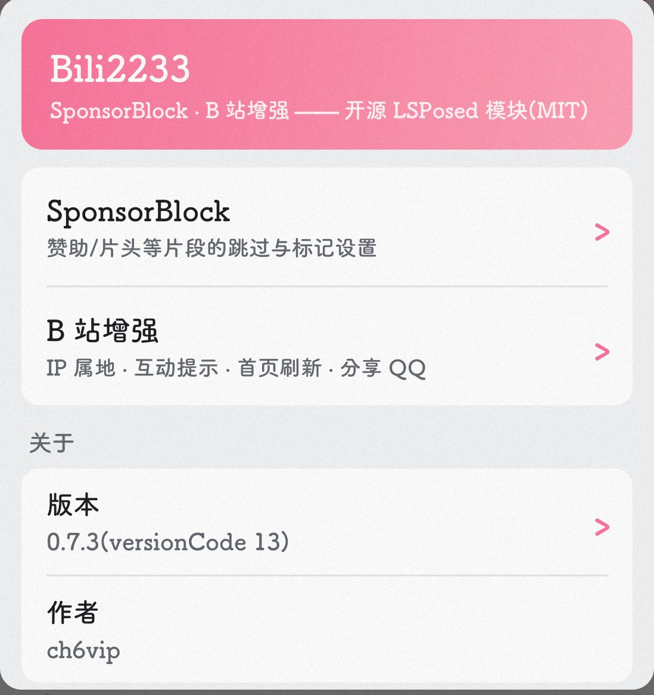
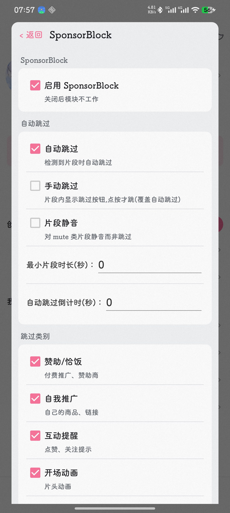
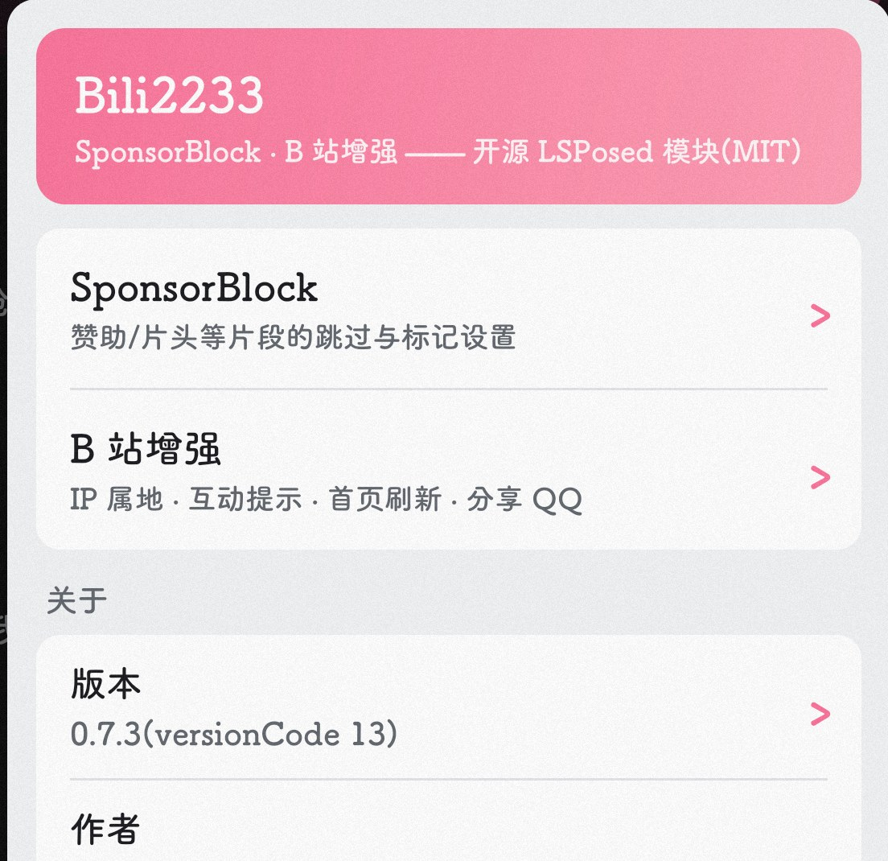

# Bili2233 · B站 SponsorBlock 跳过模块

Bili2233 是一个需要 LSPosed 框架的模块。它使用 SponsorBlock 社区片段数据，在哔哩哔哩**国际版**播放视频时
自动跳过或标记赞助内容、片头、自我推广、互动提醒等片段。只改本机播放行为：不登录、不接管账号、无遥测。

> 本项目主要由 AI 编写：代码、文档与宿主逆向分析由 AI 生成，作者负责需求、真机验证与发版，
> 因此不保证稳定性与持续维护。欢迎提 Issue / PR 一起贡献——尤其是「适配新版宿主」这件最费人力的事。

## ⚠️ 免责声明

- 个人学习性质的第三方项目，与哔哩哔哩**没有任何关系**，非官方、未获授权。
- 只修改本机播放行为；不破解会员、不去除广告投放、不绕过服务端限制、不伪造播放量或修改数据上报
  （「B 站增强 · IP 属地」仅改写请求中的客户端身份字段，见[数据与隐私](#数据与隐私)）。
- 不提供、不分发哔哩哔哩客户端安装包，需自备目标版本；片段数据由社区众包，准确性由数据源决定。
- 使用产生的一切后果由使用者自行承担，请遵守当地法规与哔哩哔哩用户协议。

## 适用范围

| 项目 | 要求 |
| --- | --- |
| 哔哩哔哩客户端 | **国际版 `com.bilibili.app.in` 6.5.0（9110200）/ 6.6.0（9130300）** |
| Android | 6.0+（`minSdk 23`） |
| 运行环境 | 已 Root（KernelSU / Magisk），安装支持 **libxposed API 101** 的 LSPosed |

6.5.0 与 6.6.0 均已在真机完成回归。其他版本可能无法正常工作——宿主每次改版都可能重命名 Hook 目标类，
更新哔哩哔哩后如遇失效，请先确认客户端版本是否仍受支持（适配方法见 [`tools/dexscan/README.md`](tools/dexscan/README.md)）。

## 功能

- 自动跳过片段；也可改为片段内显示按钮**手动跳过**，或跳过前显示**倒计时**（可取消）。
- 对标记为静音的片段**静音播放**而非跳过。
- 播放器进度条按类别显示**彩色片段标记**（颜色可自定义），剩余时长会**扣减**已跳过部分。
- 显示跳过提示，统计累计跳过次数与节省时长。
- 可按类别启用/关闭，并设置最小片段时长过滤。
- 播放器「空降助手」面板：片段信息、提交片段、手动跳过、刷新片段等。
- **B 站增强**（默认关闭，移植自 [BiliTamer](https://github.com/mengwuzhuanshou/BiliTamer)）：
  评论/主页 **IP 属地**、**隐藏互动提示**（一键三连 / UP 关注气泡 / 投票）、
  **首页不自动刷新**、分享面板补回 **分享到 QQ**。

支持的类别：赞助/恰饭、自我推广、互动提醒、开场动画、结束画面、回顾/概要、非音乐片段、填充内容、精彩时刻。

## 效果预览

「我的」页或播放器面板进入控制中心；SponsorBlock 设置页可调整跳过、类别与颜色；
深色模式下弹窗同样可读。

  
  
  

## 安装与启用

1. 从 [Releases](https://github.com/ch6vip/lsposed-bili-sponsorblock/releases/latest) 下载
   `Bili2233-vX.Y.Z.apk`，像普通应用一样安装。发布包用固定密钥签名，可直接覆盖升级——
   请认准证书指纹，别装来路不明的二次打包版：
   `SHA-256 16:9C:2F:C3:A7:E5:C7:93:6B:D8:72:5E:D4:2E:36:AB:DF:68:E7:64:31:C4:DF:5D:25:CC:D6:7A:73:42:E9:DF`
   （debug 包与构建方法见[开发者文档](docs/RELEASING.md)）。
2. 打开 **LSPosed** 管理界面，启用 **Bili2233** 模块。
3. 作用域**只勾**「哔哩哔哩国际版」（`com.bilibili.app.in`），不需要勾系统框架。
4. **强制停止哔哩哔哩**后重新打开，模块即生效。

## 设置说明

设置入口有三处（同一套界面）：桌面图标 **Bili2233**、哔哩哔哩「我的」页的 **Bili2233**、
播放页「⋯」→ 更多面板 → **空降助手**。常用选项：

| 设置 | 说明 |
| --- | --- |
| 启用 SponsorBlock | 模块总开关，关闭后完全不工作。 |
| 自动跳过 / 手动跳过 / 倒计时 | 自动跳过命中片段，或片段内显示按钮手动跳，或先倒计时再跳。 |
| 片段静音 | 对静音类别片段静音，而不是跳过。 |
| 最小片段时长 | 忽略短于所设时长的片段；`0` 表示不过滤。 |
| 跳过类别与标记颜色 | 九个类别逐个开关，各类别进度条颜色自定义。 |
| 界面显示 | 跳过提示、进度条标记、剩余时长扣减、跳过统计。 |
| 服务器地址 / 缓存 TTL | 任何兼容 SponsorBlock API 的实例，默认 `https://bsbsb.top`；片段本地缓存时长。 |
| 用户 ID / 默认标记类别 | 提交片段用的本地标识（与 B 站账号无关）与默认提交分类。 |
| B 站增强 | IP 属地 / 隐藏互动提示（三连·UP 气泡·投票）/ 首页不自动刷新 / 分享到 QQ，全部默认关闭。 |

SponsorBlock 设置修改后**重进播放页**生效；「B 站增强」开关约 10 秒内热生效。

## 数据与隐私

- 查询片段时只向设置中的 SponsorBlock 实例请求数据。请求使用视频 ID 的 **SHA-256 前 4 位**作为前缀，
  客户端再按完整视频 ID 本地匹配——这是 SponsorBlock 官方的隐私设计。
- 提交片段时使用本地随机生成的用户 ID，与哔哩哔哩账号无关。「B 站增强 · IP 属地」会改写宿主请求中的
  客户端身份字段（`mobi_app` 等），让服务端返回属地字段；关闭开关则完全不动。
- 模块不登录账号、不接管账号、没有遥测埋点；设置与统计只存本机。默认服务器是
  「[小电视空降助手](https://github.com/hanydd/BilibiliSponsorBlock)」的 `bsbsb.top`（非官方
  `sponsor.ajay.app`），可换成任何兼容实例。

## 常见问题

**安装后没有效果？**
确认 LSPosed 已启用模块、作用域包含 `com.bilibili.app.in`，并强制停止哔哩哔哩后重新打开；
同时确认宿主是国际版 6.5.0 / 6.6.0。

**部分视频没有跳过片段？**
片段来自社区提交，并非每个视频都有人标记；也请检查分类开关和服务器地址。

**修改设置后不生效？**
SponsorBlock 设置需重进播放页；「B 站增强」开关约 10 秒内热生效。

**更新哔哩哔哩后失效了？**
宿主改版后 Hook 目标类名大概率变化，需要模块适配。欢迎带 LSPosed 日志里的
`[probe] hook summary: N/M hit` 一行提 Issue——它能直接看出哪些 Hook 没命中。

**设置入口在哪？**
桌面图标 **Bili2233**、哔哩哔哩「我的」页 **Bili2233**、播放页「⋯」→ 更多面板 → **空降助手**，三处同一套界面。

## 已知限制

- 仅适配国际版 6.5.0 / 6.6.0；宿主更新后可能**静默失效**（日志 `hook summary` 可快速判断）。
- 已验证场景：切集（含 PGC→UGC 状态重置）、小窗（轮询存活）、番剧（PGC 优雅降级，
  数据源无 PGC 片段属预期）；未验证：OGV 纪录片、切换账号。
- 片段数据依赖第三方实例，可用性与数据质量由数据源决定。
- IP 属地依赖服务端对请求身份的判定，宿主改版后可能失效（仅表现为无属地显示）；分享 QQ 需已安装 QQ。

## 致谢

- [小电视空降助手 · hanydd/BilibiliSponsorBlock](https://github.com/hanydd/BilibiliSponsorBlock) ——
  默认数据源与「空降助手」叫法、片段分类体系的来源
- [SponsorBlock](https://sponsor.ajay.app/) —— 片段数据与 API 协议
- [mengwuzhuanshou/BiliTamer](https://github.com/mengwuzhuanshou/BiliTamer)（MIT）——「B 站增强」的实现蓝本
- [BiliRoaming](https://github.com/yujincheng08/BiliRoaming) / [BiliRoamingX](https://github.com/BiliRoamingX/BiliRoamingX) —— 思路参考
- [LSPosed](https://github.com/LSPosed/LSPosed) / [libxposed](https://github.com/libxposed) —— 框架与 API

开发者文档（架构、Hook 点对照、真机验证、构建与发布流程）见 [`docs/`](docs/) 与 [`docs/RELEASING.md`](docs/RELEASING.md)。

## 许可

[MIT](LICENSE) © 2026 ch6vip
